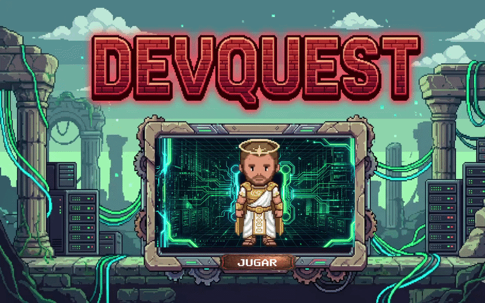

# ⚔️ DevQuest: Mi Portfolio Interactivo



¡Bienvenido a **DevQuest**! Este proyecto es mucho más que un currículum tradicional; es un portfolio interactivo y un videojuego 2D desarrollado como Trabajo de Fin de Grado (TFG) para el ciclo de Desarrollo de Aplicaciones Multiplataforma. 

Diseñado con una estética pixel art nostálgica (inspirada en clásicos como Pokémon o Habbo Hotel), el jugador controla a mi avatar personal a través de un mundo que representa mi trayectoria profesional y formativa.

---

## 🎮 Características Principales

* **Exploración Narrativa:** El mapa está compuesto por diferentes "edificios" (como el IES Ágora o CESUR). Entrar en cada uno de ellos desbloquea información sobre mis estudios, proyectos y experiencia laboral.
* **Sistema de Logros Avanzado:** Un árbol de habilidades dinámico y persistente. Los logros se desbloquean al explorar el mapa, coleccionar items o interactuar con el entorno, culminando en logros maestros (Full Stack, Platino).
* **Inventario Dinámico y HUD:** Un sistema completo para gestionar coleccionables (armas, monstruos de código) y cambiar la "skin" (outfit) del personaje en tiempo real, con una interfaz de usuario fluida y libre de bugs visuales.
* **Viaje Rápido y Persistencia:** Sistema de guardado y teletransporte que mantiene la memoria del progreso del jugador intacta entre diferentes escenas gracias a una arquitectura sólida de Managers (Singletons).

---

## 💻 Stack Tecnológico y Arquitectura

Este proyecto ha sido construido aplicando buenas prácticas de programación y patrones de diseño de la industria de los videojuegos:

* **Motor:** Unity 6
* **Lenguaje:** C#
* **Almacenamiento de Datos:** Sistema basado en archivos JSON y `PlayerPrefs` para cargar y guardar la persistencia de los logros y el progreso del jugador de forma estructurada.
* **Arquitectura:** * Uso intensivo del patrón **Singleton** para la gestión de sistemas core (Gestor de Logros, Inventario, Notificaciones).
  * Separación de lógica y presentación (UI) inspirada en el modelo **MVC**.
  * Carga asíncrona y escaneos de colisiones mediante `Coroutines`.

---

## 🚀 Instalación y Ejecución

1. Clona este repositorio:
   ```bash
   git clone [https://github.com/tu-usuario/DevQuest.git](https://github.com/tu-usuario/DevQuest.git)
